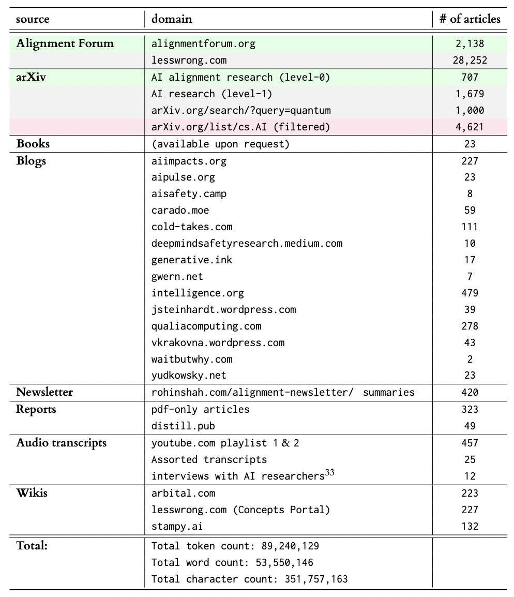

# AI Alignment Research Dataset
A dataset of alignment research and code to reproduce it. You can download version 1.0 of the dataset [here](https://the-eye.eu/public/AI/Alignment/moirage_alignment-research-dataset/).

For more information about the dataset, have a look at our [paper](https://arxiv.org/abs/2206.02841) or [LessWrong](https://www.lesswrong.com/posts/FgjcHiWvADgsocE34/a-descriptive-not-prescriptive-overview-of-current-ai) post.

## Sources

Below, you can find a table of the number of texts in the dataset grouped into various sources. The table is up-to-date with version 1.0 of the dataset (June 4th, 2022).



## Development Environment

To set up the development environment, run the following steps:

```bash
git clone https://github.com/moirage/alignment-research-dataset
cd alignment-research-dataset
pip install -r requirements.txt
```
You will also need do install [grobid](https://github.com/kermitt2/grobid) on your machine to run some of the scripts. There is some documentation [here](https://grobid.readthedocs.io/en/latest/Install-Grobid/) on how to install it. The config.json file in the root of this repository is for grobid.

## Using the Dataset

The dataset is in .jsonl format. Each line is a new entry for that dataset. To load the dataset, you can use the `jsonlines` python package. You can load the dataset using the following:

```
import jsonlines

dictionary = {}
with jsonlines.open("alignment_texts.jsonl", "r") as reader:
  for entry in reader:
    try:
      # grab contents of each entry here, example:
      # dictionary[i]['text'] = entry['text']
    except KeyError:
      pass
```

### What Keys are in Each JSON of the Dataset?

The important thing here is that not all of the dataset entries contain all the same keys (though they all have the `text` key). That said, the key names are standardized so you should not run into any issues where `source` in one entry is something like `source_of_entry` in another. We do this because it doens't make sense to say "journal_ref" when we are talking about an audio transcript. So, you will need to make sure you add a `try-except` in your code if you want to grab things other than `text`.

For now, if you would like to know the specific keys from each source in the dataset, please look at the code for that source in [align_data](./align_data).

Here's what the data for the arXiv papers looks like:

```
{
"source": "arxiv", # where the dataset comes from
"source_type": "latex", # the type of file the data was original in
"converted_with": "pandoc", # which tool we used to convert the data in .md format
"paper_version": paper_id,
"title": title,
"authors": [str(x) for x in authors], # list of authors
"date_published": date_published,
"data_last_modified": data_last_modified,
"url": url,
"abstract": abstract,
"author_comment": author_comment,
"journal_ref": journal_ref,
"doi": doi,
"primary_category": primary_category,
"categories": categories,
"citation_level": citation_level, # (0 = curated alignment papers, 1 = citation of curated papers, 2 = citation of citation, etc.)
"alignment_text": is_alignment_text, # 'pos' is maunally labeled as an alignment paper, 'unlabeled' if unlabeled
"confidence_score": confidence_scores, # this is a confidence score obtained by using the SPECTER model to classify papers to add to the dataset
"main_tex_filename": "main.tex", # the main latex file needed to convert the paper
"text": "lots of text", # this is where you will grab the text contents of each entry in the dataset (in .md format)
"bibliography_bbl": "string of bbl",
"bibliography_bib": "string of bib", # more common to have bib than bbl
}
```

### The 80/20 for using the dataset

As we said in the previous section, all entries have the `text` key which contains the text content for that entry. Here's some other common keys you might use:

1. `source`: this key separates the various keys found in the table in [Sources](##Sources). Here's the set of sources with their corresponding value name:

* 'https://aipulse.org'
* 'ebook'
* 'https://qualiacomputing.com'
* 'alignment forum'
* 'lesswrong'
* 'manual'
* 'arxiv'
* 'https://deepmindsafetyresearch.medium.com/'
* 'waitbutwhy.com'
* 'GitHub'
* 'https://aiimpacts.org'
* 'arbital.com'
* 'carado.moe'
* 'nonarxiv_papers'
* 'https://vkrakovna.wordpress.com'
* 'https://jsteinhardt.wordpress.com'
* 'audio-transcripts'
* 'https://intelligence.org'
* 'youtube'
* 'reports'
* 'https://aisafety.camp'
* 'curriculum'
* 'https://www.yudkowsky.net'
* 'distill'

2. `alignment_text`: This is label specific to the arXiv papers. We added papers to the dataset using Allen AI's SPECTER model and included all the papers that got a confidence score of over 75%. However, since we could not verify with certainty that those papers where about alignment, we've decided to create the `alignment_text` key with the value `"pos"` when we manually labeled it as an alignment text and `"unlabeled"` when we have not labeled it yet. Additionally, we've only included the `text` for the `"pos"` entries, not the `"unlabeled"` entries.

## Contributing

Join us on EleutherAI's [discord server](https://discord.com/invite/zBGx3azzUn) in the #accelerating-alignment channel.

We are looking for people who want to contribute by adding more AI alignment text to the dataset as well as clean the data. We are currently cleaning audio transcripts that have been created using speech-to-text software, if you would like to contribute, please let us know. We are also hoping to categorize the AI alignment videos in ways that are useful for newcomers. Some initial ideas include useful search tags like required background, topic, how good the content is, and if it's a lecture or conversation.

We would like this dataset be used for good. If you have any ideas on how to help AI alignment researchers in their work, let us know. Even better if you can implement it!

## Citing the Dataset

Please use the following citation when using our dataset:

Kirchner, J. H., Smith, L., Thibodeau, J., McDonnell, K., and Reynolds, L. "Understanding AI alignment research: A Systematic Analysis." arXiv preprint arXiv:2022.4338861 (2022).
